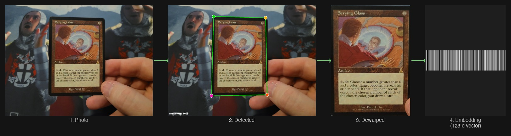
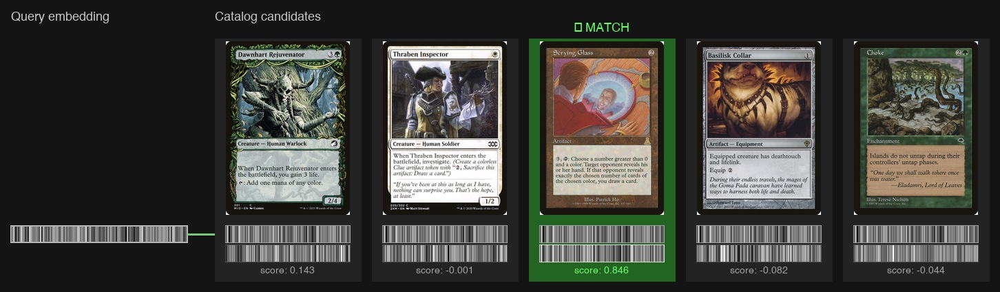

# CollectorVision

Card identification library for collectible card games. Feed it a photo, get back a card identity.

Magic: The Gathering is the primary supported catalog today. Additional non-MTG catalogs are available as highly experimental previews, and user feedback is welcome.

> **Catalog v2 is recommended for hosted catalogs.** See the
> [Catalog v1 to v2 migration guide](docs/catalog-v2-migration.md) for complete
> Python and JavaScript before/after examples. Catalog v1 remains available for
> custom NPZ catalogs.

## Try online

Experimental javascript port version hosted here: https://hanclinto.github.io/CollectorVision/


---

## Install

> **Not yet on PyPI.** Install directly from GitHub:

```bash
uv pip install "collectorvision[hf] @ git+https://github.com/HanClinto/CollectorVision.git"
uv pip install onnxruntime
```

Or with plain `pip`:

```bash
pip install "collectorvision[hf] @ git+https://github.com/HanClinto/CollectorVision.git"
pip install onnxruntime
```

Requires Python 3.10+. Neural inference requires an ONNX Runtime backend. Add
exactly one backend package to your environment, `requirements.txt`, or
`pyproject.toml`: use `onnxruntime` for CPU or `onnxruntime-gpu` for NVIDIA GPU.
The optional `hf` extra enables Hugging Face model and catalog downloads. It is
not needed for offline use with local checkpoints and cached catalogs.

### Hardware acceleration

CollectorVision uses ONNX Runtime providers through a small, simple API:

```python
cvg.NeuralCornerDetector(provider="auto")  # default: accelerator if available, then CPU
cvg.NeuralEmbedder(provider="auto")

cvg.NeuralEmbedder(provider="cpu")         # force CPU
cvg.NeuralEmbedder(provider="gpu")         # require acceleration, error if unavailable
```

The default `provider="auto"` prefers installed accelerator providers and falls
back to CPU. `provider="gpu"` means "use an accelerated ONNX Runtime provider"
and works with whatever accelerator provider ONNX Runtime exposes on the current
machine, such as CoreML, CUDA, DirectML, or ROCm.

For GPU acceleration, replace the CPU backend with a GPU backend that matches
your machine:

```bash
pip install onnxruntime-gpu
```

ONNX Runtime GPU package compatibility depends on your CUDA runtime. For example,
some CUDA 12 Linux systems need:

```bash
pip install "onnxruntime-gpu<1.27" nvidia-cudnn-cu12 nvidia-cuda-runtime-cu12
```

Avoid installing both `onnxruntime` and `onnxruntime-gpu` in the same
environment. CollectorVision warns when both distributions are present because
they provide the same `onnxruntime` Python module and can hide GPU providers.

---

## How it works

Given a photo of a card held in hand (or on a table, in a sleeve, etc.), CollectorVision finds the four corners, dewarps the card to a canonical crop, and produces a compact 128-d embedding vector:



That embedding is then matched against a catalog of ~108k reference embeddings using nearest-neighbour search:



The full pipeline runs end-to-end in under 100ms on a laptop CPU.

---

## Quickstart

```python
import cv2
import collector_vision as cvg

# Load the recommended MTG catalog (downloaded once, then updated from cache)
catalog = cvg.Catalog.load("mtg")

# 1. Detect card corners
image = cv2.imread("examples/images/7286819f-6c57-4503-898c-528786ad86e9_sample.jpg")
detector = cvg.NeuralCornerDetector()
detection = detector.detect(image)

# 2. Dewarp to aligned crop
crop = detection.dewarp(image)          # PIL Image, 448×448 px

# 3. Embed + search
emb = catalog.embedder.embed(crop)      # (128,) float32
hits = catalog.search(emb, top_k=5)    # [(score, card_id), ...]

score, card_id = hits[0]
print(card_id, score)   # "abc123-...", 0.94
```

---

## Available catalogs

Load the current recommended catalog by game:

```python
catalog = cvg.Catalog.load("mtg")
```

The default source is Scryfall for MTG and TCGplayer for other games:

```python
# Pokemon TCG
catalog = cvg.Catalog.load("pokemon")

# Star Wars: Unlimited
catalog = cvg.Catalog.load("swu")

# Explicit source override
catalog = cvg.Catalog.load("mtg", source="tcgplayer")
```

Catalog v2 currently publishes `mtg`, `pokemon`, `pokemon-japan`, `yugioh`,
`fab`, `lorcana`, `digimon`, `onepiece`, `swu`, `union-arena`, `gundam`, and
`riftbound`. MTG is the primary supported catalog; the others are previews.

Results use the selected source's identifier. TCGplayer catalogs therefore
return TCGplayer product IDs rather than Scryfall UUIDs. Use
`search_records()` for names, peer identifiers, finishes, and metadata.

Catalogs are cached after the first download. The moving v2 feed applies
incremental updates and keeps the newest compatible local snapshot.

To share results, request a specific game/source, or report a catalog issue, open an issue or reach out [on Discord](https://discord.gg/ds8SMCRFZp) or [Twitter @HanClinto](https://x.com/HanClinto).

---

## Local catalog file

Catalog v1 remains available for custom NumPy archives containing aligned card
IDs and reference embeddings. See [Build your own catalog](catalog).

Pass a local path and `Catalog.load()` selects the v1 NPZ loader without
touching the network:

```python
catalog = cvg.Catalog.load("./milo1-scryfall-mtg-2026-05-07.npz")
```

Use `cvg.CatalogV1.load(path)` or `cvg.CatalogV2.load(game)` when you want to
select a catalog generation explicitly. Neither API performs I/O in its
constructor.

---

## Multiple frames, one card

For live video, combine evidence from several recent frames. Embed each frame
separately, then sum scores before ranking:

```python
embeddings = catalog.embedder.embed([crop1, crop2, crop3])  # (3, 128)

from collections import defaultdict
score_map = defaultdict(float)
for emb in embeddings:
    for score, card_id in catalog.search(emb, top_k=5):
        score_map[card_id] += score

best_id = max(score_map, key=score_map.get)
```

## Upside-down cards

Current embeddings can be sensitive to 180-degree rotation. The
[rotation-invariant example](examples/quickstart_rot_invariant.py) embeds the
upright and rotated crop, then keeps the stronger result. The evaluation script
and web scanner use the same approach by default.

---

## Pre-cropped images

If your input is already a clean card crop, skip detection and embed directly:

```python
from PIL import Image
crop = Image.open("crop.jpg")
emb = catalog.embedder.embed(crop)
hits = catalog.search(emb)
```

---

## License

AGPL-3.0. Commercial licenses available — see [COMMERCIAL_LICENSE.md](COMMERCIAL_LICENSE.md).

## Integrations

Using CollectorVision in another project? Open an issue or PR if you want it
listed here.

## Development

```bash
uv venv
source .venv/bin/activate
uv pip install -e '.[dev]'
```

## Web Scanner

The browser scanner lives in `examples/web_scanner` and is deployed at
<https://hanclinto.github.io/CollectorVision/>.

## Playground

Demonstration:

https://www.youtube.com/watch?v=MHieOcmC7Dw

https://hanclinto.github.io/CollectorVision/applet_example.html


## Discord

Join our Discord to discuss all things CollectorVision, open-source, and computer vision:

https://discord.gg/ds8SMCRFZp
